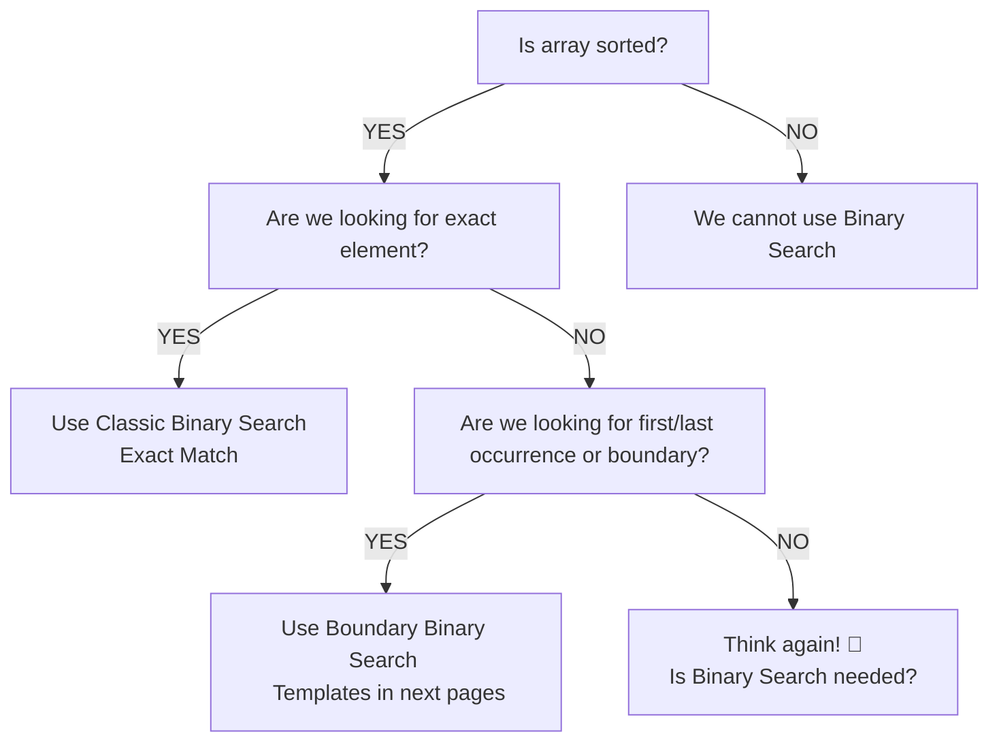

# BINARY SEARCH
## FAANG INTERVIEW CHEAT SHEET (JAVA)

**Goal:**
Reduce search space by half in every step
O(log n) time

---

### 1. WHEN TO USE BINARY SEARCH?

*   [✅] Data is sorted or can be converted to sorted.
*   [✅] We can eliminate half of the search space.
*   [✅] Answer looks like → **F F F T T T** (False → True)
*   [✅] We can check a condition in O(1) time.
*   [✅] Used for exact match, first/last occurrence, or finding answer in search space.

---

### 💡 AHA MOMENT

**Binary Search** is not about searching an element, it's about finding the boundary where the answer changes

**Example:**
| F | F | F | F | T | T | T | T |
|---|---|---|---|---|---|---|---|
&nbsp;&nbsp;&nbsp;&nbsp;&nbsp;&nbsp;&nbsp;&nbsp;&nbsp;&nbsp;&nbsp;&nbsp;&nbsp;&nbsp;&nbsp;&nbsp;&nbsp;&nbsp;&nbsp;&nbsp;&nbsp;&nbsp;&nbsp;&nbsp;&nbsp;&nbsp;&nbsp;&nbsp;&nbsp;&nbsp;&nbsp;&nbsp;**↑**
&nbsp;&nbsp;&nbsp;&nbsp;&nbsp;&nbsp;&nbsp;&nbsp;&nbsp;&nbsp;&nbsp;&nbsp;&nbsp;&nbsp;&nbsp;&nbsp;&nbsp;&nbsp;&nbsp;&nbsp;&nbsp;&nbsp;&nbsp;&nbsp;&nbsp;&nbsp;&nbsp;&nbsp;Find the **FIRST T** (transition point)

---

### 2. CLASSIC BINARY SEARCH TEMPLATE (EXACT MATCH)

```java
int left = 0, right = n - 1;
while (left <= right) {
    int mid = left + (right - left) / 2; // safe mid
    
    if (nums[mid] == target) {
        return mid; // found
    } else if (nums[mid] < target) {
        left = mid + 1;      // search right half
    } else {
        right = mid - 1;     // search left half
    }
}
return -1; // not found
```

> **Why mid = left + (right - left) / 2 ?**
> To avoid integer overflow that can happen in (left + right) / 2

---

### ⭐ INTERVIEW TIP

*   [•] Always decide what the array is trying to tell you.
*   [•] Define the condition, not the element.
*   [•] Think: **What am I searching for?**
*   [•] Dry run on examples before coding.

---

### ❌ COMMON MISTAKES

*   [❌] Wrong boundaries update (leads to infinite loop)
*   [❌] Using `mid = (left + right) / 2` (overflow risk)
*   [❌] Not handling edge cases (empty array, size 1)
*   [❌] Wrong condition ( `<` vs `<=` )
*   [❌] Returning wrong index (first/last occurrence problems)

---

### 3. BINARY SEARCH DECISION TREE



---

### 4. BINARY SEARCH ON SORTED ARRAY (EXAMPLE)

**Array:** `[5, 7, 7, 8, 8, 10]` &nbsp;&nbsp;&nbsp; **Target = 8**

**Step 1:**
| 5 | 7 | 7 | **8** | 8 | 10 |
|---|---|---|---|---|---|
| 0 | 1 | 2 | 3 | 4 | 5 |

left = 0, right = 5
mid = 2 -> nums[2] = 7
7 < 8, **move right**

**Step 2:**
| 5 | 7 | 7 | 8 | **8** | 10 |
|---|---|---|---|---|---|
| 0 | 1 | 2 | 3 | 4 | 5 |

left = 3, right = 5
mid = 4 -> nums[4] = 8
8 == 8, **found!**

**Step 3:**
| 5 | 7 | 7 | 8 | **8** | 10 |

Return index 4

---

### 5. COMPLEXITY ANALYSIS

| Operation | Complexity |
| :--- | :--- |
| Time Complexity | O(log n) |
| Space Complexity | O(1) (Iterative) |
| Best Case | O(1) (if mid is target) |
| Worst Case | O(log n) |

> **📌 Remember**
> Every step eliminates half of the search space.
> That's the power of Binary Search! 💪

---

🎯 **Master Binary Search Pattern, not just the code.**
It helps in 90% of advanced DSA problems.

**Page 1 of 4**
